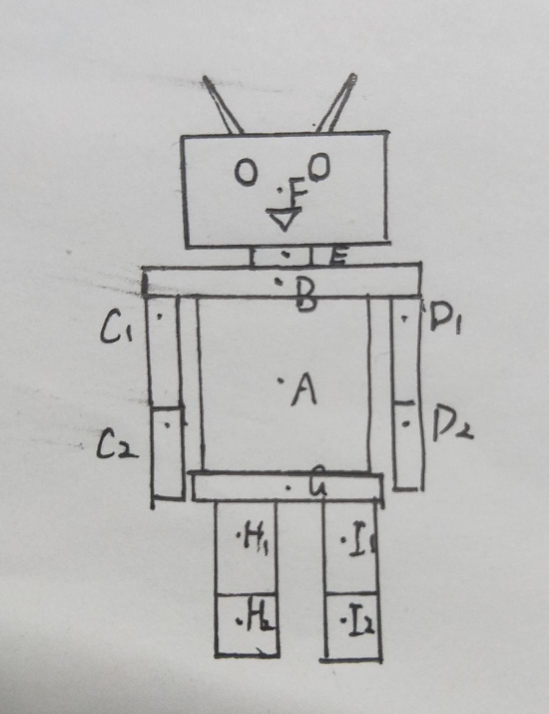
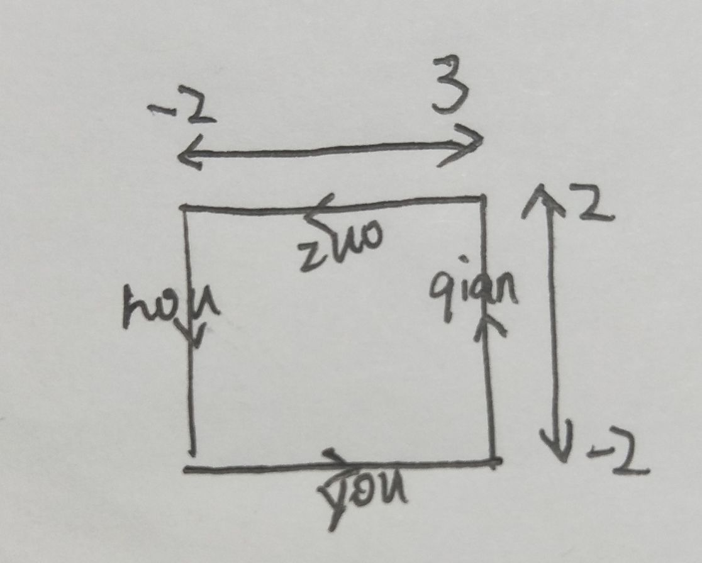

# CG Assignment2 
17341046 郭梓煜

- [CG Assignment2](#cg-assignment2)
    - [环境配置](#环境配置)
    - [实验目的](#实验目的)
    - [主要算法](#主要算法)
    - [实现思路](#实现思路)
    - [实现过程](#实现过程)
        - [绘制机器人](#绘制机器人)
        - [让机器人动起来](#让机器人动起来)
        - [绘制机器人的行动路径](#绘制机器人的行动路径)
        - [载入mesh模型围绕机器人运动](#载入mesh模型围绕机器人运动)
    - [步骤截图](#步骤截图)
    - [结果展示](#结果展示)
    - [遇到难题及解决方法](#遇到难题及解决方法)
    - [心得体会](#心得体会)


## 环境配置
---
- Qt 5.13.0
- Qt Creator
- opengl
- glew 2.1.0

## 实验目的
---
- 绘制机器人
  - 包括头，躯干等等
  - 使用GL_POINTS, GL_TRIANGLES, GL_QUADS, GL_POLYGON等基本图元
- 绘制机器人的运动路线
  - 使用平移、旋转函数
  - 我选择的线路为圆
- 绘制机器人的动作
  - 具有摆臂及抬腿两个基本动作
- 载入其他mesh模型围绕机器人运动
## 主要算法
---
- 绘制矩形
    ```c++
    glBegin(GL_QUADS);//绘制矩形
    //四个点
    glVertex3f(-0.5f, 1.0f, 0.25f);
    glVertex3f(0.5f, 1.0f, 0.25f);
    glVertex3f(0.5f, -1.0f, 0.25f);
    glVertex3f(-0.5f, -1.0f, 0.25f);
    glEnd();//结束绘制
    ```
- 绘制圆形
    ```c++
    float R = 0.02f, pi = 3.1415926536f;//赋值半径，pi值
    for (int i = 0; i < 100; i++)//100即绘制圆上100个点
    {
        glBegin(GL_LINE_STRIP);//绘制连线，将圆上的点与固定一点连线组成圆柱体
        glVertex3f(R * cos(2 * pi / 100 * i), 0.0f, R * sin(2 * pi / 100 * i));//圆上各点
        glVertex3f(0.2f, 0.5f, 0.0f);//天线顶点
        glEnd();//结束绘制
    }
    ```
- 使物体运动  
采用全局变量，通过定时器update调用paintGL重新绘制图形，在paintGL中改变全局变量的物体位置值以及角度，来实现每一次绘制时物体的位置以及角度都不一样，从而实现运动。
## 实现思路
---
1. 构造两个待实现的类：MyGLWidget，ObjLoader  
进而实现其中的类函数
2. 机器人的绘制  
一开始拿到这个题目，没什么思路，自然少不了借鉴网上的代码，其中[github的代码](https://github.com/ruange/stick-man/blob/master/stickman.cpp)令我获益匪浅。
3. mesh模型的加载  
用记事本先观察obj文件的具体内容，再对其进行读取，绘制，这样实现就避免走不少的弯路。
## 实现过程
---
### 绘制机器人
- 分为DrawBody，DrawShoulder，DrawHip，DrawArmA，DrawArmB，DrawLegA，DrawLegB，DrawNeck，DrawHead九个部分。
  - 其中除了DrawHead以外的其余八个都比较简单，都是采用`GL_QUADS`来绘制六个面，组成立方体。 
    - 颜色可用glColor3f自由选择，可选择很多种颜色，详见[RGB颜色对照表](https://wenku.baidu.com/view/13ab59a2366baf1ffc4ffe4733687e21ae45ff53.html) 
    - `glBegin`,`glEnd`：开始，结束绘制
    - `glVertex3f`：绘制三维的点
    - 实现代码如下：
  （以DrawBody为例）
    ```c++
    /*###################################################
    ##  函数: DrawBody
    ##  函数描述： 画机器人的身体
    ##  参数描述： 无
    #####################################################*/
    void DrawBody()
    {
        glColor3f(0.87843f, 1.0f, 1.0f);//设置颜色为LightCyan
        glBegin(GL_QUADS);//绘制矩形
        //forward 四个点
        glVertex3f(-0.5f, 1.0f, 0.25f);
        glVertex3f(0.5f, 1.0f, 0.25f);
        glVertex3f(0.5f, -1.0f, 0.25f);
        glVertex3f(-0.5f, -1.0f, 0.25f);
        //left 四个点
        glVertex3f(0.5f, 1.0f, 0.25f);
        glVertex3f(0.5f, 1.0f, -0.25f);
        glVertex3f(0.5f, -1.0f, -0.25f);
        glVertex3f(0.5f, -1.0f, 0.25f);
        //back 四个点
        glVertex3f(0.5f, 1.0f, -0.25f);
        glVertex3f(-0.5f, 1.0f, -0.25f);
        glVertex3f(-0.5f, -1.0f, -0.25f);
        glVertex3f(0.5f, -1.0f, -0.25f);
        //right 四个点
        glVertex3f(-0.5f, 1.0f, 0.25f);
        glVertex3f(-0.5f, 1.0f, -0.25f);
        glVertex3f(-0.5f, -1.0f, -0.25f);
        glVertex3f(-0.5f, -1.0f, 0.25f);
        //top 四个点
        glVertex3f(0.5f, 1.0f, 0.25f);
        glVertex3f(0.5f, 1.0f, -0.25f);
        glVertex3f(-0.5f, 1.0f, -0.25f);
        glVertex3f(-0.5f, 1.0f, 0.25f);
        //bottom 四个点
        glVertex3f(0.5f, -1.0f, 0.25f);
        glVertex3f(0.5f, -1.0f, -0.25f);
        glVertex3f(-0.5f, -1.0f, -0.25f);
        glVertex3f(-0.5f, -1.0f, 0.25f);
        glEnd();//结束绘制
    }
    ```
  - DrawHead的实现
    - DrawHead与其他部位不同，需要绘制的不仅是头部的立方体，还有眼睛嘴巴和天线。
    - 绘制眼睛嘴巴和天线时，需要通过`glTranslate`将原点移至想画的圆点。
    - `glPushMatrix()`，`glPopMatrix()`：将矩阵入栈，出栈，可记录坐标系状态。
    - 眼睛和天线涉及到了圆形以及圆锥体的绘制。
      - 眼睛: 画圆只需将圆上每个点以`GL_POLYGON`来连接绘制，只要点数达到一定数目，形状自然会逼近圆形。
      - 天线: 画圆锥体则是在画圆的基础上将圆上每个点与一个固定顶点以`GL_LINE_STRIP`来连接即可。
      - 嘴巴：相较于上面两个较简单，只需绘制三个点，以`GL_LINE_LOOP`连接即可。  
    - 绘制流程：glPushMatrix->移动原点->绘制图像->glPopMatrix
    - 代码如下：  
    （其中头部以及天线，眼睛等重复代码省略，具体可见代码文件）
    ```c++
    /*###################################################
    ##  函数: DrawHead
    ##  函数描述： 画机器人的头部，包括头，眼睛，嘴巴，天线等
    ##  参数描述： 无
    #####################################################*/
    void DrawHead()
    {
        glColor3f(1.0f, 0.93725f, 0.85882f);//设置颜色为AntiqueWhite1
        glBegin(GL_QUADS);//绘制矩形

        //头部点绘制与上一部分DrawBody类似，此处略去
        
        glEnd();//结束绘制

        //绘制天线1
        glPushMatrix();//将矩阵压栈保存
        glTranslatef(0.2f, 0.5f, 0.0f);//将原点移至头顶偏右的位置
        glColor3f(0.87843f, 1.0f, 1.0f);//设置颜色为LightCyan
        float R = 0.02f, pi = 3.1415926536f;//赋值半径，pi值
        for (int i = 0; i < 100; i++)//100即绘制圆上100个点
        {
            glBegin(GL_LINE_STRIP);//绘制连线，将圆上的点与固定一点连线组成圆柱体
            glVertex3f(R * cos(2 * pi / 100 * i), 0.0f, R * sin(2 * pi / 100 * i));//圆上各点
            glVertex3f(0.2f, 0.5f, 0.0f);//天线顶点
            glEnd();//结束绘制
        }
        glPopMatrix();//矩阵出栈

        //绘制天线2
        //与绘制天线1类似，此处略去
        ···
    
        //绘制眼睛1
        glPushMatrix();//将矩阵压栈保存
        glTranslatef(0.2f, 0.1f, 0.36f);//将原点移至前脸偏右的位置
        R = 0.1f;//赋值眼睛半径
        glBegin(GL_POLYGON);//绘制多边形，只要顶点够多就与圆相近
        glColor3f(0.72157f, 0.52549f, 0.04314f);//设置颜色为chocolate
        for (int i = 0; i < 100; i++)//100即绘制圆上100个点
        {
            glVertex2f(R * cos(2 * pi / 100 * i), R * sin(2 * pi / 100 * i));//圆上各点
        }
        glEnd();//结束绘制
        glPopMatrix();//矩阵出栈
    
        //绘制眼睛2
        //与绘制眼睛2类似，此处略去

        //绘制嘴巴
        glPushMatrix();//将矩阵压栈保存
        glTranslatef(0.0f, 0.0f, 0.36f);//将原点移至前脸的平面
        glBegin(GL_LINE_LOOP);//绘制连线
        glColor3f(0.72157f, 0.52549f, 0.04314f);//设置颜色为chocolate
        glVertex2f(-0.1f, -0.2f);//嘴巴的三个点
        glVertex2f(0.0f, -0.3f);
        glVertex2f(0.1f, -0.2f);
        glEnd();//结束绘制
        glPopMatrix();//矩阵出栈
    }
    ```
- 实现了九个机器人部件的绘制函数后，就需要在MyGLWidget的类函数paintGL函数调用来实现绘制  
要将这九个组合起来成为我们想要的机器人
  - 首先，画出拼接好的机器人模型，如下图：    
      
  - 其次，opengl的矩阵栈存储的是坐标系变换的矩阵，`glPushMatrix()`将矩阵入栈，`glPopMatrix()`将矩阵出栈。栈底部的矩阵（坐标系）所做的变换都会影响栈上部的矩阵（坐标系）。
    
    - 注意到我们的组成机器人的立方体都是建立在自己的坐标系上的，所以我们需要通过不断地使用`glTranslatef`，`glRotatef`来变换坐标系（原点）。
  - 最后，确定绘制路线。
    - 如图，从Body的中心`A`开始，利用`gltranslatef(0.0,0.8,0.0)`将坐标系向上移动0.8到达`B`点，B点为shoulder中心，但此时先不画shoulder，先`glPushMatrix()`，再`glTranslatef(0.8, -0.4, 0.0)`到达 `D1` 点，D1 点为上胳膊中心，仍`glPushMatrix()`，向下平移1.2到达 `D2` ，D2 为下臂中心，此时可以调用`DrawArmB()`画出下臂，画完后我们需要回到上一个层次，调用`glPopMatrix()`，回到 D1 点，再调用`DramArmA()`函数画出上臂，`glPopMatrix()`回到B点，然后同样地向上，向左可以画出头部脖子和左胳膊。再pop到A点画出Body，向下移动可以画出双腿及跨部。  
    - 绘制流程：  （P1代表glPushMatrix()，P2代表glPopMatrix()）
      - A->B->P1->D1->P1->D2->DrawArmB()->P2->DrawArmA()->P2->E->P1->F->DrawHead()->P2->Drawneck()->P2->C1->P1->C2->DrawArmA()->P2->DrawArmB()->P2->P2->G->P1->I1->P1->I2->DrawlegA->P2->DrawlegB->P2->P1->H1->P1->H2->DrawlegA->P2->DrawlegB->P2->DrawHip->P2->DrawBody
      - 去掉P1，P2还有draw即
        - A->B->D1->D2->D1->B->E->F->E->B->C1->C2->C1->B->A
        - A->G->I1->I2->I1->G->H1->H2->H1->G->A
      - 实际上，如图：   
         
  - 主要代码实现如下；  
    （由于重复部分出栈入栈较多，较为复杂，所以展示部分路线，当中部分省略减少篇幅具体代码可在代码文件中查看）
    ```c++
    glClear(GL_COLOR_BUFFER_BIT | GL_DEPTH_BUFFER_BIT);//清除颜色缓冲以及深度缓冲
    glLoadIdentity();//重置当前指定的矩阵为单位矩阵
    glTranslatef(0.0f, 0.0f, -35.0f);//移动原点
  
    draw_circle();//绘制圆形路径 <--------
  
    glRotatef(angle, 0, 1, 0);//旋转坐标轴
    glPushMatrix();//将矩阵压栈保存
    glTranslatef(0.0f, 0.0f, -15.0f);//移动原点
    glRotatef(-90, 0, 1, 0);
    glPushMatrix();//将矩阵压栈保存
    ···
    glTranslatef(-0.8, 0.0, 0.0);//移动原点
    glTranslatef(0.0, -0.4, 0.0);
    glRotatef(angleofrarmb, 1, 0, 0);//旋转胳膊
    glPushMatrix();//将矩阵压栈保存
    glTranslatef(0.0, -0.8, 0.0);//移动原点
    glTranslatef(0.0, -0.3, 0.0);
    glRotatef(angleofrarma, 1, 0, 0);//旋转胳膊
    DrawArmA();//绘制下半胳膊
    glPopMatrix();//矩阵出栈
    DrawArmB();//绘制上半胳膊
    glPopMatrix();//矩阵出栈
    ···
    //回到 shoulder，即回到B点
    glPushMatrix();//将矩阵压栈保存
    glTranslatef(0.0, 0.3, 0.0);
    glPushMatrix();//将矩阵压栈保存
    glTranslatef(0.0, 0.6, 0.0);
    DrawHead();
    glPopMatrix();//矩阵出栈
    DrawNeck();//绘制脖子
  
    Drawflyhorse();//绘制飞马 <------
  
    glPopMatrix();//矩阵出栈
    DrawShoulder();
    glPopMatrix();//矩阵出栈
    //回到 body，即回到A点
    ···
  
    glPushMatrix();//将矩阵压栈保存
    glTranslatef(-0.4, 0.0, 0.0);//移动原点
    glTranslatef(0.0, -0.4, 0.0);
    glRotatef(angleofrlegb, 1, 0, 0);//旋转腿
    glPushMatrix();//将矩阵压栈保存
    glTranslatef(0.0, -1.5, 0.0);//移动原点
    glRotatef(angleofrlega, 1, 0, 0);//旋转腿
    DrawLegA();//绘制下半腿
    glPopMatrix();//矩阵出栈
    DrawLegB();//绘制上半腿
  
     Draweagle();//绘制老鹰<-------
  
    glPopMatrix();//矩阵出栈
    DrawHip();//绘制跨部
    glPopMatrix();//矩阵出栈
    DrawBody();//绘制身体
    glPopMatrix();//矩阵出栈
    glPopMatrix();//矩阵出栈
    glPopMatrix();//矩阵出栈
    ···
    glFlush();//将指令送往缓硬件立即执行
    ```
### 让机器人动起来
接下来，如何让机器人动起来是一个问题。
- 根据已给出的模板实现的定时器会定时update，调用paintGL重新绘制可知，只需每次paintGL时改变机器人的位置以及机器人胳膊和腿的角度即可。
- 我使用全局变量来记录机器人的绕圈角度以及胳膊，腿的角度。  
    全局变量还有更多，以下展示涉及机器人部分：
    ```c++
    /*#####################################################################
    ##  全局变量的声明
    ##  angleof: l代表left，a,b代表下，上腿或胳膊，arm，leg代表胳膊，腿
    ##  la,ra,ll,rl：前面的l,r代表左，右，后面的a,l代表arm，leg
    ##              所存数值代表对应胳膊或腿的摆动角度，将实时改变
    ##  a,b,c,angle,angle1,angle2：存储角度变化数值，用于使胳膊，腿变化角度
    ##                       可直接改动来改变机器人转动，以及胳膊，腿摆动快慢
    #####################################################################*/
    float angleoflarma, angleoflarmb, angleofrarma, angleofrarmb = 0;
    float angleofllegb, angleofrlegb, angleofllega, angleofrlega = 0;//四肢躯干角度
    float la, ra, ll, rl = 0;//存储中间变量角度
    float a = 0.2, b = 0.1, c = 0.18, angle = 0.2;//机器人旋转所用参数
    const float angle1 = 0.4, angle2 = 0.2;
    ```
- 剩下的就是，根据机器人运动的位置以及胳膊，腿运动的位置来决定全局变量的值，通过这一次的paintGL调用影响下一次的绘制。
  - 以一条胳膊的位置角度来推其他四肢的摆动角度，这样实现起来就不那么复杂了。
  - 分情况讨论其位置情况，分别赋值，改变下次绘制的角度。
  - 我将这部分代码独立开来为change_robot函数  
  代码如下：  
  （同样省去部分减少篇幅，详见代码文件）
    ```c++
    /*###################################################
    ##  函数: change_robot
    ##  函数描述： 改变机器人的运动方向及轨迹
    ##  参数描述： 无
    #####################################################*/
    void change_robot()
    {
        //修改胳膊，腿的角度
        angleoflarma += la;//左下胳膊
        angleofrarma += ra;//右下胳膊
        angleoflarmb += a;//左上胳膊
        angleofrarmb -= a;//右下胳膊

        angleofllega += ll;//左下腿
        angleofrlega += rl;//右下腿
        angleofllegb -= b;//左上腿
        angleofrlegb += b;//右上腿
        angle += c;//机器人本身旋转角度

        //以一条胳膊的位置角度来推其他四肢的摆动角度

        //若左上胳膊在摆动范围0-50
        if (50 > angleoflarmb && angleoflarmb > 0 && a > 0)
        {
            //修改下次绘制摆动数值
            a = angle1;//赋值固定角度
            b = angle2;
            la = -angle1 * 0.75;//乘以一定比例使上下胳膊存在合适角度
            ra = -angle1;
            ll = 0.75 * angle2;//乘以一定比例使上下腿存在合适角度
            rl = angle2 * 1.5;
        }
        //若左上胳膊在摆动范围>=50
        ···
        //若左上胳膊在摆动范围>0
        ···
        //若左上胳膊在摆动范围-50-0
        ···
        //若左上胳膊在摆动范围<=-50
        ···
        //若左上胳膊在摆动范围<=0
        ···
    }
    ```
    
### 绘制机器人的行动路径
- 与之前画眼睛的画圆形类似，不过这次采用`GL_LINE_LOOP`不用`GL_POLYGON`，将所有点连线，因为我不需要将圆内也涂上颜色。  
- 其余的将原点移至圆心绘制即可。
- 绘制流程：glPushMatrix->移动原点->绘制图像->glPopMatrix
- 主要代码如下：
```c++
/*###################################################
##  函数: draw_circle
##  函数描述： 绘制机器人的行动路径
##  参数描述： 无
#####################################################*/
void draw_circle()
{
    glPushMatrix();//将矩阵压栈保存
    glTranslatef(0.0f, -1.0f, 25.5f);//将原点移至圆形路径中间
    glBegin(GL_LINE_LOOP);//绘制连线，只要顶点够多就与圆相近
    glColor3f(1.0f, 1.0f, 1.0f);//设置颜色为白色
    float R = 4.2f, pi = 3.1415926536f;
    for (int i = 0; i < 100; i++)
    {
        glVertex3f(R * cos(2 * pi / 100 * i), 0.0, R * sin(2 * pi / 100 * i)); //圆上各点
    }
    glEnd();//结束绘制
    glPopMatrix();//矩阵出栈
}
```

### 载入mesh模型围绕机器人运动
- 首先是创建一个obj载入的类`ObjLoader`
    ```c++
    class ObjLoader
    {
    public:
        ObjLoader(string filename);//构造函数
        void Draw();//绘制函数
    private:
        vector<vector<GLfloat>>vSets;//存放顶点(x,y,z)坐标
        vector<vector<GLint>>fSets;//存放面的三个顶点索引
    };
    ```

- 类的实现
  - 构造函数  
    - 简单地加载obj文件，需要考虑不同的obj文件类型，观察我的obj文件查看其面信息的格式发现为‘f x/x/x x/x/x x/x/x’格式。  
    - 针对obj文件中的v(顶点)，f(面)进行读取
    - 将点，面加载进对应的集合
    ```c++
    /*###################################################
    ##  函数: ObjLoader::ObjLoader
    ##  函数描述： ObjLoader类的构建函数，加载路径下的obj文件
    ##           读入到全局变量的类实例中
    ##  参数描述： filename（string）obj文件的路径
    #####################################################*/
    ObjLoader::ObjLoader(string filename)
    {
        //简单的读取obj文件
        std::ifstream file(filename);//读取文件流
        std::string line;
        while (getline(file, line))//获取每一行
        {
            if (line.substr(0, 2) == "vt")
            {
                //暂不实现
            }
            else if (line.substr(0, 2) == "vn")
            {
                //暂不实现
            }
            else if (line.substr(0, 1) == "v")//若该行存储顶点
            {
                vector<GLfloat> Point;//存储点的vector
                GLfloat x, y, z;
                std::istringstream s(line.substr(2));
                s >> x;
                s >> y;
                s >> z;//利用stream读取将点坐标读入到x,y,z
                Point.push_back(x);
                Point.push_back(y);
                Point.push_back(z);//将点坐标放入vector
                vSets.push_back(Point);//将每个point的vector存储在点集的vector中

            }
            else if (line.substr(0, 1) == "f")//若改行存储面信息
            {
                //观察obj文件查看其面信息的格式发现为‘f x/x/x x/x/x x/x/x’格式
                std::replace(line.begin(), line.end(), '/', ' ');//将'/'去掉，替换为空格
                vector<GLint> vIndexSets;//存储构成面的点标号
                GLint u, u1, u2, v, v1, v2, w, w1, w2;
                std::istringstream vtns(line.substr(2));
                vtns >> u >> u1 >> u2;
                vtns >> v >> v1 >> v2;
                vtns >> w >> w1 >> w2;//读取点序号，存储于u,v,w
                vIndexSets.push_back(u - 1);
                vIndexSets.push_back(v - 1);
                vIndexSets.push_back(w - 1);//将序号记入vector
                fSets.push_back(vIndexSets);//将vector记入fsets面集
            }
            else if (line.substr(0, 1) == "#")
            {
                //暂不实现
            }
            else
            {
                //暂不实现
            }
        }
        file.close();//关闭读取
    }
    ```
  - 功能函数draw的实现
    - 根据读取obj文件数据存储的两个vector取出每个面的三个顶点
    - 根据每个面的三个顶点，计算法向量，再绘制法向量，绘制三角面片
    ```c++
    /*###################################################
    ##  函数: ObjLoader::Draw
    ##  函数描述： ObjLoader类的功能函数
    ##        将加载到类实例中的obj文件在OpenGL中绘制出来
    ##  参数描述： 无
    #####################################################*/
    void ObjLoader::Draw()
    {
        glBegin(GL_TRIANGLES);//开始绘制
        for (int i = 0; i < fSets.size(); i++)
        {
            GLfloat VN[3];
            //三个顶点
            GLfloat SV1[3];
            GLfloat SV2[3];
            GLfloat SV3[3];

            if ((fSets[i]).size() != 3)//若该面没有三个顶点
            {
                cout << "the fSetsets_Size is not correct" << endl;
            }
            else
            {
                GLint firstVertexIndex = (fSets[i])[0];//取出顶点索引
                GLint secondVertexIndex = (fSets[i])[1];
                GLint thirdVertexIndex = (fSets[i])[2];

                SV1[0] = (vSets[firstVertexIndex])[0];//第一个顶点
                SV1[1] = (vSets[firstVertexIndex])[1];
                SV1[2] = (vSets[firstVertexIndex])[2];

                SV2[0] = (vSets[secondVertexIndex])[0]; //第二个顶点
                SV2[1] = (vSets[secondVertexIndex])[1];
                SV2[2] = (vSets[secondVertexIndex])[2];

                SV3[0] = (vSets[thirdVertexIndex])[0]; //第三个顶点
                SV3[1] = (vSets[thirdVertexIndex])[1];
                SV3[2] = (vSets[thirdVertexIndex])[2];

                GLfloat vec1[3], vec2[3], vec3[3];//计算法向量
                //(x2-x1,y2-y1,z2-z1)
                vec1[0] = SV1[0] - SV2[0];
                vec1[1] = SV1[1] - SV2[1];
                vec1[2] = SV1[2] - SV2[2];
    
                //(x3-x2,y3-y2,z3-z2)
                vec2[0] = SV1[0] - SV3[0];
                vec2[1] = SV1[1] - SV3[1];
                vec2[2] = SV1[2] - SV3[2];
    
                //(x3-x1,y3-y1,z3-z1)
                vec3[0] = vec1[1] * vec2[2] - vec1[2] * vec2[1];
                vec3[1] = vec2[0] * vec1[2] - vec2[2] * vec1[0];
                vec3[2] = vec2[1] * vec1[0] - vec2[0] * vec1[1];
    
                GLfloat D = sqrt(pow(vec3[0], 2) + pow(vec3[1], 2) + pow(vec3[2], 2));
    
                VN[0] = vec3[0] / D;
                VN[1] = vec3[1] / D;
                VN[2] = vec3[2] / D;
    
                glNormal3f(VN[0], VN[1], VN[2]);//绘制法向量
    
                glVertex3f(SV1[0], SV1[1], SV1[2]);//绘制三角面片
                glVertex3f(SV2[0], SV2[1], SV2[2]);
                glVertex3f(SV3[0], SV3[1], SV3[2]);
            }
        }
        glEnd();//结束绘制
    }
    ```
- 绘制加载的obj文件
  - 我加载了两个obj文件，一个是飞马，一个是老鹰
     ```c
     //obj文件路径
    string filename_1 = "../eagle.obj";
    string filename_2 = "../flyhorse.obj";//obj文件路径
    ObjLoader objModel = ObjLoader(filename_1);
    ObjLoader objModel1 = ObjLoader(filename_2);//载入obj文件，创建类实例
    ```
  - 平移旋转缩放，再调用实现的draw函数即可实现绘制  
    此处展示一个（老鹰）绘制  
    ```c
    /*###################################################
    ##  函数: Draweagle
    ##  函数描述： 画老鹰
    ##  参数描述： 无
    #####################################################*/
    void Draweagle()
    {
        glPushMatrix();//将矩阵压栈保存
        glColor3f(0.0f, 1.0f, 1.0f);//设置颜色为青色
        glTranslatef(eagle_x, -1.0, eagle_y);//将老鹰坐标根据时间变换,通过改变eagle_x，eagle_y实现
        glRotatef(eagle_angle, 0, 1, 0);//将老鹰旋转方向，使其面向运动方向
        glScalef(0.3, 0.3, 0.3);//缩放老鹰至合适的大小
        objModel.Draw();//调用类函数绘制老鹰
        glPopMatrix();//矩阵出栈
    }

    ```
- 让加载入的mesh模型围绕机器人运动  
 （以老鹰为例，飞马与之类似，不再赘述，可见代码文件中）
  - 同样和机器人一样使用全局变量即前面出现的eagle_x，eagle_y，eagle_angle，只需改变其值，随着paintGL的更新绘制，就可实现让mesh模型围绕机器人运动。  
    ```c
    /*#####################################################################
    ##  全局变量的声明
    ##  high，up：high为肩头飞马的弹跳高度，up：1即跳起，0即落下
    ##  eagle_x,eagle_y,eagle_angle：环绕老鹰的运动坐标以及其旋转角度
    ##  qian,hou,zuo,you：记录老鹰的运动方向，1为按该方向前进，0在该方向不变
    #####################################################################*/
    float high = -0.5, up = 1.0;//肩头飞马所用参数
    float eagle_x = 3.0, eagle_y = -2.0, eagle_angle = 0.0; //老鹰所用参数
    float qian = 1.0, hou = 0.0, zuo = 0.0, you = 0.0;
    ```
  - 画出其运动路线  
     
  - 每次遇到拐角，就需要改变运动状态以及老鹰的旋转角度
    - 实现老鹰在机器人周围盘旋的效果
    - 代码如下：  
        ```c++
        /*###################################################
        ##  函数: change_eagle
        ##  函数描述： 改变老鹰的坐标以及角度，方向
        ##  参数描述： 无
        #####################################################*/
        void change_eagle()
        {
            if(qian == 1.0)eagle_y += 0.05;//若现运动方向为前，则将y坐标缓增
            if(hou == 1.0)eagle_y -= 0.05;//若现运动方向为后，则将y坐标缓减
            if(zuo == 1.0)eagle_x -= 0.05;//若现运动方向为左，则将x坐标缓增
            if(you == 1.0)eagle_x += 0.05;//若现运动方向为右，则将y坐标缓减

            if(eagle_y >= 2)//若y坐标前进到一定位置，进行转向
            {
                zuo = 1.0;//由前进转为左转
                qian = 0.0;
                eagle_angle = 270;//改变老鹰运动朝向
            }
            if(eagle_x >= 3)//若x坐标前进到一定位置，进行转向
            {
                you = 0.0;//由右向转为前进
                qian = 1.0;
                eagle_angle = 0;//改变老鹰运动朝向
            }
            if(eagle_y <= -2)//若y坐标前进到一定位置，进行转向
            {
                you = 1.0;//由后走转为右转
                hou = 0.0;
                eagle_angle = 90;//改变老鹰运动朝向
            }
            if(eagle_x <= -2)//若x坐标前进到一定位置，进行转向
            {
                zuo = 0.0;//由左转改为后走
                hou = 1.0;
                eagle_angle = 180;//改变老鹰运动朝向
            }
        }
        ```
- 最后，在paintGL最后调用Draweagle和change_eagle即可绘制盘旋的老鹰。  
同样地，调用Drawflyhorse和change_flyhorse画出飞马。
    ```c++
    void MyGLWidget::paintGL()
    {
        // Your Implementation
        glClear(GL_COLOR_BUFFER_BIT | GL_DEPTH_BUFFER_BIT);//清除颜色缓冲以及深度缓冲
        glLoadIdentity();//重置当前指定的矩阵为单位矩阵
        glTranslatef(0.0f, 0.0f, -35.0f);//移动原点

        draw_circle();//绘制圆形路径<--------
        ···
        Drawflyhorse();//绘制飞马<--------
        ···
        Draweagle();//绘制老鹰<--------
        ···
        //修改飞马位置
        change_flyhorse();
        //修改老鹰位置
        change_eagle();
        //修改机器人位置
        change_robot();

        glFlush();//清空缓冲区，将指令送往缓硬件立即执行
    }
    ```

## 步骤截图
---
由上述实现过程，总结出四个步骤：
- 绘制机器人  
截图:  
 
- 让机器人动起来  
动图：  

   
- 绘制机器人的路径  
动图：  

   

- 加载mesh模型围绕机器人  
  - 加载飞马   
    动图：   

       

  - 加载老鹰   
    动图：   

        

    
## 结果展示
---
    
由于录屏帧率有限以及Markdown文件显示，所以上图gif有些模糊粗糙以及不够完整，具体实现结果在运行代码后可见。  
## 遇到难题及解决方法
---
1. 物体绘制问题  
一开始不知道如何美观地绘制机器人，着实让我困扰了许久，直到在网上找到了理想的[借鉴对象](https://github.com/ruange/stick-man)，这才开始了我的实验。 
2. 物体运动问题  
如何使绘制的机器人运动起来也是一个难题。在与同学讨论过后，然后仔细查看了模板中定时器的作用，随即恍然大悟。可以通过每一次调用paintGL改变全局变量来实现每一次绘制物体的不同位置，造成物体运动的现象。
3. 加载mesh模型问题  
一开始不了解mesh模型（obj文件）的内容以及如何加载，在网上阅读了相关的加载方法才解决了这个难题。
## 心得体会
---
通过这一次的实验，对库函数实现的`GL_LINE_LOOP` ,`GL_LINE_STRIP` ,`GL_QUADS` ,`GLRotatef` ,`GLTranslatef`等函数的不同实现方法有了更深刻的理解，另外对于`glpushmatrix`，`glpopmatrix`有了更透彻的理解，而且对于如何画圆以及画圆锥体有了更深刻的了解，还有就是如何制作动图，使机器人运动起来。更重要的是，如何加载mesh模型，这次实现的加载obj文件只是简略的版本，以后有时间一定将这部分代码完善。总的来说，这次实验让我真正走进了OpenGL的世界，获益匪浅。