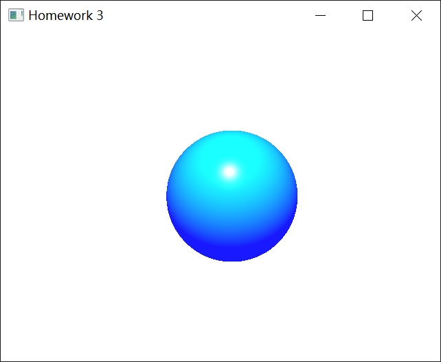
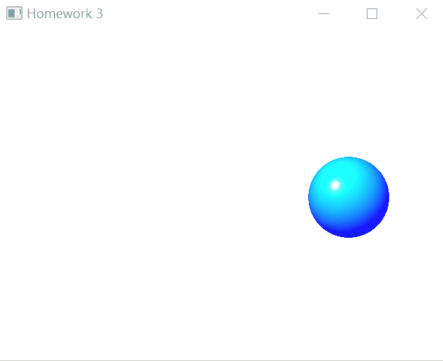

## CG Assignment3 
17341046 郭梓煜
<!-- TOC -->

- [CG Assignment3](#cg-assignment3)
    - [环境配置](#环境配置)
    - [实验目的](#实验目的)
    - [主要算法](#主要算法)
        - [phong shading](#phong-shading)
        - [使用VBO绘制小球](#使用vbo绘制小球)
        - [启动`GL_POINT_SPRITE_ARB`利用`GL_POINTS`绘制小球](#启动gl_point_sprite_arb利用gl_points绘制小球)
    - [实现思路](#实现思路)
    - [实现过程](#实现过程)
        - [着色器的编程设置](#着色器的编程设置)
        - [使用VBO进行绘制以及点精灵绘制小球](#使用vbo进行绘制以及点精灵绘制小球)
        - [使用glm库函数对矩阵进行操作](#使用glm库函数对矩阵进行操作)
    - [结果展示](#结果展示)
    - [遇到难题及解决方法](#遇到难题及解决方法)
    - [心得体会](#心得体会)

<!-- /TOC -->
### 环境配置
---
- Qt 5.13.0
- Qt Creator
- opengl
- glew 2.1.0
- glm

### 实验目的
---
- 使用GL_POINTS绘制沿固定轨道运动的小球
  - 每个glVertex调用指明一个小球的球心位置。
  - 小球大小根据离观察点距离变化（近大远小）。
  - 使用Phong Shading。
- （选做）使用VBO进行绘制
### 主要算法
---
#### phong shading
  - 光照效果 = 环境光 + 漫反射 +  镜面反射
  - vertex shader source
    ```c++
    ···
    //计算phone shading所需向量
    vertex_to_eye =  eye_position - vec3(vertex_in_modelview_space );
    vertex_to_light = light_position - vec3(vertex_in_modelview_space);

    //设置球体直径，近大远小
    float dist = dot(vertex_to_eye,vertex_to_eye);
    gl_PointSize = radius*2/dist;
    ···
    ```
  - fragment shader source
    ```c++
    ···

    //模拟球体法向量，计算当前片段的法向量
    vec3 FragNormal = vec3(temp,sqrt(1-r));

    //计算片段的phone着色
    const vec4 AmbientColor = vec4(0.1,0.1,2.0,0.1);
    const vec4 DiffuseColor = vec4(0.0,1.0,0.0,1.0);
    const vec4 SpecularColor = vec4(1.0,1.0,1.0,0.0);

    vec3 normalized_vertex_to_light= normalize(vertex_to_light);
    float DiffuseTerm = clamp(dot(FragNormal, normalized_vertex_to_light), 0.0, 1.0);

    //sepcular
    vec3 half_angle_vertex = normalize(vertex_to_eye+vertex_to_light);
    float SpecularTerm =  max(pow(dot(half_angle_vertex,FragNormal),a),0.0);

    FragColor = AmbientColor+DiffuseTerm*DiffuseColor+SpecularTerm*SpecularColor;
    ···
    ```
#### 使用VBO绘制小球
  - 根据PPT的代码以及网上的教程进行实现
    ```c++
    unsigned int VBO;
    GLfloat point_vbo[3] = {-0.0f, -0.0f, 0.0f};//点坐标

    glGenBuffers(1, &VBO);//设置1为缓冲ID，生成一个VBO对象

    glBindBuffer(GL_ARRAY_BUFFER, VBO);
    //顶点缓冲对象缓冲类型，把新创建的缓冲绑定到GL_ARRAY_BUFFER目标上
 
    //把用户定义的顶点数据复制到缓冲的内存中（当前绑定缓冲）
    glBufferData(GL_ARRAY_BUFFER, sizeof(float) * 3,
                 point_vbo, GL_STATIC_DRAW);//第四个参数：数据绘制的改变情况
    
    glVertexAttribPointer(0, 1, GL_FLOAT, GL_FALSE,
                          sizeof(float), 0);
    //告诉OpenGL如何解析顶点数据（应用到逐个顶点上）
    //第一个参数对应顶点着色器position顶点属性的位置值（location）
    glDrawArrays(GL_POINTS, 0, 1);//绘制点
    ```
  
#### 启动`GL_POINT_SPRITE_ARB`利用`GL_POINTS`绘制小球
    ```c++
    ···
    glEnable(GL_POINT_SPRITE_ARB);//点精灵
    glTexEnvi(GL_POINT_SPRITE_ARB, GL_COORD_REPLACE_ARB, GL_TRUE);
    glEnable(GL_VERTEX_PROGRAM_POINT_SIZE_NV);
    ···
    glDrawArrays(GL_POINTS, 0, 1);//绘制点
    ···
    ```

### 实现思路
---

1. 构造待实现的类：MyGLWidget，继承QOpenGLWidget和QOpenGLFunctions  
进而实现其中的类函数
1. 调用glm库，方便在实现过程中矩阵的生成，平移等计算。
2. 使用VBO进行绘制
3. 使用点精灵`GL_POINT_SPRITE_ARB`把粒子显示成一个小球
### 实现过程
---
#### 着色器的编程设置
  - 顶点着色器
    ```c++
    #version 330 core

    //glVertex所指定顶点位置
    layout(location = 0) in vec3 position;

    //建模、观察、投影矩阵
    uniform mat4 model;
    uniform mat4 view;
    uniform mat4 projection;
    uniform vec3 eye_position; //照相机位置
    uniform vec3 light_position; //光源位置
    uniform float radius;

    //phone shading模型所需向量
    varying vec3 vertex_to_light;
    varying vec3 vertex_to_eye;

    void main()
    {
        vec4 vertex_in_modelview_space = view*model*vec4(position,1);
        gl_Position =projection*view*model*vec4(position,1);

        //计算phone shading所需向量
        vertex_to_eye =  eye_position - vec3(vertex_in_modelview_space );
        vertex_to_light = light_position - vec3(vertex_in_modelview_space);

        //设置球体直径，近大远小
        float dist = dot(vertex_to_eye,vertex_to_eye);
        gl_PointSize = radius*2/dist;
    }
    ```
  - 片段着色器
    ```c++
    out vec4 FragColor;

    varying  vec3 vertex_to_light;
    varying vec3 vertex_to_eye;
    uniform float a;

    void main()
    {
        //将超出圆的片段丢弃
        vec2 temp = gl_PointCoord*2 - vec2(1);
        float r = dot(temp,temp);
        if (r>1.0 ) discard;

        //模拟球体法向量，计算当前片段的法向量
        vec3 FragNormal = vec3(temp,sqrt(1-r));

        //计算片段的phone着色
        const vec4 AmbientColor = vec4(0.1,0.1,2.0,0.1);
        const vec4 DiffuseColor = vec4(0.0,1.0,0.0,1.0);
        const vec4 SpecularColor = vec4(1.0,1.0,1.0,0.0);

        vec3 normalized_vertex_to_light= normalize(vertex_to_light);
        float DiffuseTerm = clamp(dot(FragNormal, normalized_vertex_to_light), 0.0, 1.0);

        //sepcular
        vec3 half_angle_vertex = normalize(vertex_to_eye+vertex_to_light);
        float SpecularTerm =  max(pow(dot(half_angle_vertex,FragNormal),a),0.0);

        FragColor = AmbientColor+DiffuseTerm*DiffuseColor+SpecularTerm*SpecularColor;
    }

    ```
  - 读取文件
    ```c++
    vertex_shader_source = get_source("E:\\code\\Qt\\CGTemplate3\\vertexshadersource.vert");
    fragment_shader_source = get_source("E:\\code\\Qt\\CGTemplate3\\fragmentshadersource.frag");
    ```
    - get_source函数
    ```c++
    string MyGLWidget::get_source(const char* filename)
    {
        ifstream infile;
        infile.open(filename, ios::in);
        if(!infile.is_open())
        {
            cout << filename << endl;
            cout << "Can not find this file" << endl;
            return "";
        }
        string source;
        while(!infile.eof())
        {
            string line;
            getline(infile, line);
            source += line;
            source += '\n';
        }
        source += '\0';
        return source;
    }
    ```
  - 将着色器编译，绑定，链接，使用
    - 对小球的半径等系数进行设置
    ```c++
    const char*  vsource = vertex_shader_source.c_str();
    const char* fsource = fragment_shader_source.c_str();

    GLuint vertexShader = glCreateShader(GL_VERTEX_SHADER);//创建顶点着色器程序容器
    GLuint fragmentShader = glCreateShader(GL_FRAGMENT_SHADER);//创建片段着色器程序容器

    glShaderSource(vertexShader, 1, &vsource, 0);
    //将顶点着色程序的源代码字符数组绑定到顶点着色器对象
    glShaderSource(fragmentShader, 1, &fsource, 0);
    //将片段着色程序的源代码字符数组绑定到片段着色器对象

    glCompileShader(vertexShader);//编译顶点着色器对象
    glCompileShader(fragmentShader);//编译片段着色器对象
    program = glCreateProgram();//创建一个（着色）程序对象；
    glAttachShader(program, vertexShader);//将顶点着色器对象附加到（着色）程序对象上
    glAttachShader(program, fragmentShader);//将片段着色器对象附加到（着色）程序对象上
    glLinkProgram(program);//对（着色）程序对象执行链接操作
    ···
    glUseProgram(program);//将OpenGL渲染管道切换到着色器模式，并使用刚才做好的（着色）程序对象

    glUniform1f(glGetUniformLocation(program, "radius"), 600.0f);//半径
    glUniform3f(glGetUniformLocation(program, "eye_position"), 0, 0, 4);
    glUniform3f(glGetUniformLocation(program, "light_position"), 0, - 2, 4);
    glUniform1f(glGetUniformLocation(program, "a"), 100); //高光系数
    ```

#### 使用VBO进行绘制以及点精灵绘制小球 
    ```c++
    glEnable(GL_POINT_SPRITE_ARB);//点精灵
    glTexEnvi(GL_POINT_SPRITE_ARB, GL_COORD_REPLACE_ARB, GL_TRUE);
    glEnable(GL_VERTEX_PROGRAM_POINT_SIZE_NV);

    unsigned int VBO;
    GLfloat point_vbo[3] = {-0.0f, -0.0f, 0.0f};//点坐标

    glGenBuffers(1, &VBO);//设置1为缓冲ID，生成一个VBO对象
    glBindBuffer(GL_ARRAY_BUFFER, VBO);//顶点缓冲对象缓冲类型，把新创建的缓冲绑定到GL_ARRAY_BUFFER目标上

    glBufferData(GL_ARRAY_BUFFER, sizeof(float) * 3,//把用户定义的顶点数据复制到缓冲的内存中（当前绑定缓冲）
                 point_vbo, GL_STATIC_DRAW);//第四个参数：数据绘制的改变情况


    glVertexAttribPointer(0, 1, GL_FLOAT, GL_FALSE,
                          sizeof(float), 0);//告诉OpenGL如何解析顶点数据（应用到逐个顶点上）
    //第一个参数对应顶点着色器position顶点属性的位置值（location）
    glDrawArrays(GL_POINTS, 0, 1);//绘制点
    ```
#### 使用glm库函数对矩阵进行操作
    ```c++
    float wind_r = 1.5;

    glTranslatef(wind_r * cos(glm::radians(angle)), 0.0, wind_r * sin(glm::radians(angle)));
    glm::mat4 model_matrix = glm::mat4(1.0);
    model_matrix = glm::translate(model_matrix, glm::vec3(wind_r * cos(glm::radians(angle)), 0.0, wind_r * sin(glm::radians(angle))));

    glm::mat4 view_matrix = glm::mat4(1.0);//单位矩阵

    GLuint model_loc = glGetUniformLocation(program, "model");
    GLuint view_loc = glGetUniformLocation(program, "view");
    GLuint projection_loc = glGetUniformLocation(program, "projection");

    glUniformMatrix4fv(model_loc, 1, GL_FALSE, glm::value_ptr(model_matrix));
    glUniformMatrix4fv(view_loc, 1, GL_FALSE, glm::value_ptr(view_matrix));
    glUniformMatrix4fv(projection_loc, 1, GL_FALSE, glm::value_ptr(projection_matrix));
    ```
### 结果展示
---
   
截图如上  
   
动图如上  
由于录制gif帧率原因，运动轨迹上可能留有残影。  
### 遇到难题及解决方法
---
1. 数据类型问题  
在使用glm库时，很多函数的参数存在类型限制，否则会出现错误。比如使用`glm::radians`将角度制转为弧度制时，转换的参数必须是float类型。否则会出现报错 
2. 小球绘制问题  
一开始看到这个题目，使用`GL_POINTS`绘制小球还以为是绘制成千上万的点组成小球，后来和同学进行讨论然后到网上学习，才知道启动`GL_POINT_SPRITE_ARB`可以把粒子显示成一个小球，这才解决了问题。参考链接在[这里](https://blog.csdn.net/jackers679/article/details/7589828)。  
1. 着色器编程问题   
这次实验是我第一次真正接触着色器编程，所以未免有些陌生。仔细参考了网上的教程才开始迈入GLSL的大门。参考教程在[这里](https://learnopengl-cn.github.io/01%20Getting%20started/05%20Shaders/#_8)。还有phong shading也是在网上进行学习的，链接在[这里](https://blog.csdn.net/iteapoy/article/details/88753428)。
2. VBO绘制  
使用VBO进行绘制即将顶点数据存储在GPU缓存中，无须CPU到GPU的数据传递，并且可以动态修改。真正让我对VBO有深刻了解的还是在看了[这篇文章](https://www.jianshu.com/p/60a392df9f03?tdsourcetag=s_pctim_aiomsg)之后。    

### 心得体会
---
通过这一次的实验，对着色器的编程以及如何用`GL_POINTS`绘制小球有了更深刻的理解，另外对于如何使用VBO绘制也有了更透彻的理解。总的来说，这次实验让我真正走进了GLSL的世界，获益匪浅。